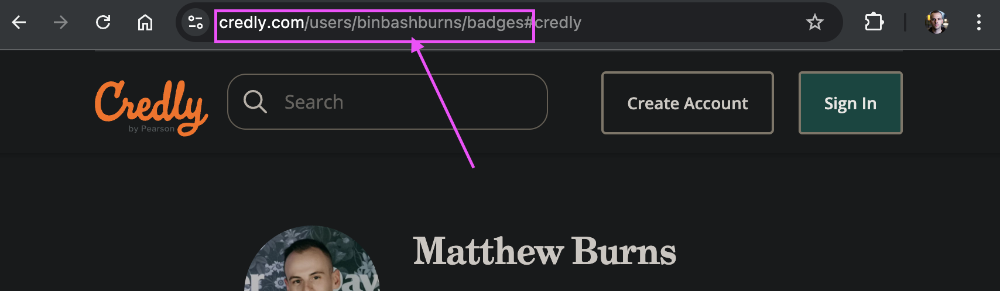
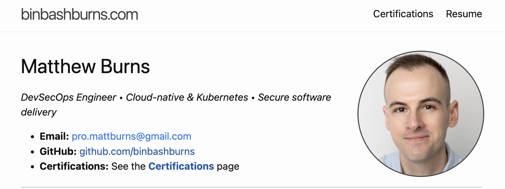
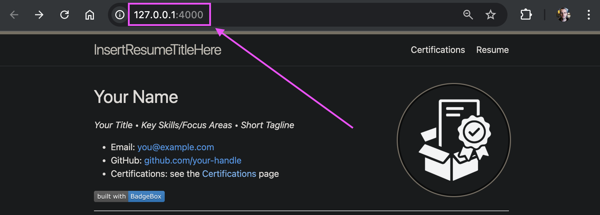
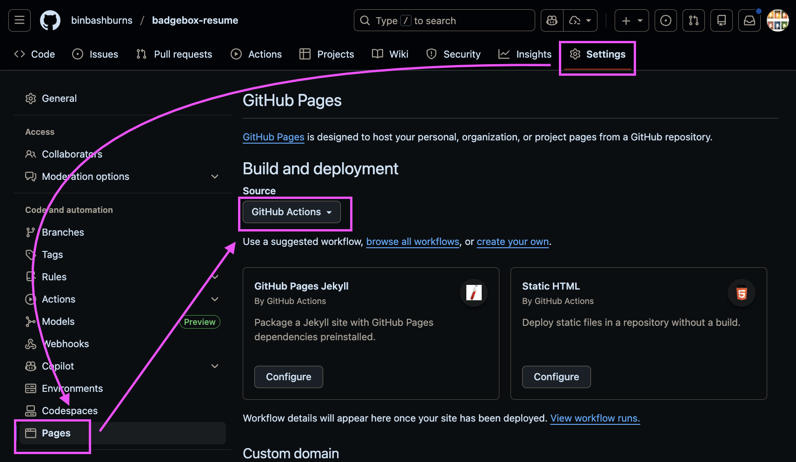

# Badge Box Resume Template


Generate a personal résumé website with live certification badges from Credly.

Fork this repo, plug in your Credly account, customize the content, and you’ll have a local site and a GitHub Pages deployment.

---

## What you get

- `src/BadgeBox.Api` – .NET 9 API that fetches and normalizes public Credly badges
- `src/BadgeBox.Cli` – CLI that writes normalized JSON into the Jekyll site
- `website/` – Jekyll résumé + badges site
- `.github/workflows/website-build.yml` – GitHub Pages deployment workflow

---

## 1. Fork and clone

1. On GitHub, click **Fork** on this repository.
2. Clone your fork locally:

   ```bash
   git clone https://github.com/<your-github-username>/badgebox-resume.git
   cd badgebox-resume
   ```

---

## 2. Install prerequisites

You’ll need:

- [.NET SDK 9.0+](https://dotnet.microsoft.com/en-us/download/dotnet/9.0)
- Ruby 3.x and `bundler` (for Jekyll)

Use your OS’s standard installers or package manager (Homebrew on macOS, apt on Ubuntu, etc.). Once Ruby is installed, add Bundler:

```bash
gem install bundler
```

---

## 3. Get your Credly user ID

You need your Credly **user GUID** (not your username).

1. Open your public Credly profile in a browser.
2. Note the username part of the URL: `https://www.credly.com/users/<your-credly-username>/badges`.
3. Run one of the commands below. It will print a GUID like `xxxxxxxx-xxxx-xxxx-xxxx-xxxxxxxxxxxx`. Save this; you’ll use it as `USER_ID` both when running the CLI locally and in the GitHub Actions workflow.



macOS / Linux (bash or zsh):

```bash
CREDLY_USERNAME="<your-credly-username>"
curl -sL -H 'User-Agent: Mozilla/5.0' "https://www.credly.com/users/${CREDLY_USERNAME}/badges" \
  | grep -Eo '/users/[0-9a-fA-F-]{36}' \
  | head -n1 \
  | cut -d'/' -f3
```

Windows (PowerShell):

```powershell
$credlyUsername = '<your-credly-username>'
$headers = @{ 'User-Agent' = 'Mozilla/5.0' }
$html = (Invoke-WebRequest -UseBasicParsing -Headers $headers "https://www.credly.com/users/$credlyUsername/badges").Content
([regex]::Match($html, '/users/([0-9a-fA-F-]{36})')).Groups[1].Value
```

---

## 4. Customize your résumé

Update the content so the site looks like you:

- Edit `website/index.md` – name, contact info, experience, projects (a starter template is already there).
- Replace `website/assets/img/profile.png` with your own headshot (keep the same filename).
- Update site metadata in `website/_config.yml` – set `title` and `description`.

That’s all you need to change to get a personalized site.



---

## 5. Run everything locally (end to end)

### 5.1 Build and test

```bash
dotnet restore BadgeBox.sln
dotnet build -c Release BadgeBox.sln
dotnet test -c Release BadgeBox.sln
```

### 5.2 Start the BadgeBox API

In one terminal:

```bash
dotnet run --project src/BadgeBox.Api/BadgeBox.Api.csproj --urls http://localhost:5080
```

You can check it with:

```bash
curl -s http://localhost:5080/health
```

### 5.3 Generate badges JSON with the CLI

In a second terminal, from the repo root:

macOS / Linux (bash or zsh):

```bash
export BADGEBOX_API=http://localhost:5080
export USER_ID=<your-credly-guid>       # GUID from step 3
export OUT_FILE=website/_data/credly-badges.json
export STATUS_FILE=status.json

dotnet run -c Release --project src/BadgeBox.Cli/BadgeBox.Cli.csproj
```

Windows (PowerShell):

```powershell
$env:BADGEBOX_API = 'http://localhost:5080'
$env:USER_ID = '<your-credly-guid>'       # GUID from step 3
$env:OUT_FILE = 'website/_data/credly-badges.json'
$env:STATUS_FILE = 'status.json'

dotnet run -c Release --project src/BadgeBox.Cli/BadgeBox.Cli.csproj
```

This writes your normalized Credly badges to `website/_data/credly-badges.json` so Jekyll can render them.

### 5.4 Run the Jekyll website

In a third terminal:

```bash
cd website
bundle install
bundle exec jekyll serve -s . -d ../_site
```

Then open `http://127.0.0.1:4000` in your browser to see your résumé + badges.



---

## 6. Deploy to GitHub Pages

This repo already includes a GitHub Actions workflow at `.github/workflows/website-build.yml`.

1. In your fork, open `.github/workflows/website-build.yml` and change the `USER_ID` value under `env:` to your own Credly GUID from step 3 (this is required for the workflow to pull **your** badges).

   ```yaml
   env:
     USER_ID: your-guid-here  # replace with GUID from step 3
   ```

2. Commit and push your changes to the `main` branch of your fork.
3. In your GitHub repository settings, enable **GitHub Pages** and set the source to **GitHub Actions**.
4. Push to `main` again (or wait for the next push). The workflow will:
   - build and run the API
   - run the CLI to generate `website/_data/credly-badges.json`
   - build the Jekyll site into `_site`
   - publish to GitHub Pages

After the workflow completes, your site will be live at the URL shown in the Pages settings.



---

## Project structure (reference)

```text
src/
  BadgeBox.Api/       # Minimal API
  BadgeBox.Cli/       # Console app (fetch -> write JSON)
tests/
  BadgeBox.Tests/     # xUnit tests
website/
  _data/credly-badges.json  # generated by CLI
  _includes/badge-grid.html  # renders badges in the site
  assets/css/*.css           # styles
  index.md, badges.md        # pages
BadgeBox.sln
```

---

## License

GPL-3.0 — see `LICENSE`.
